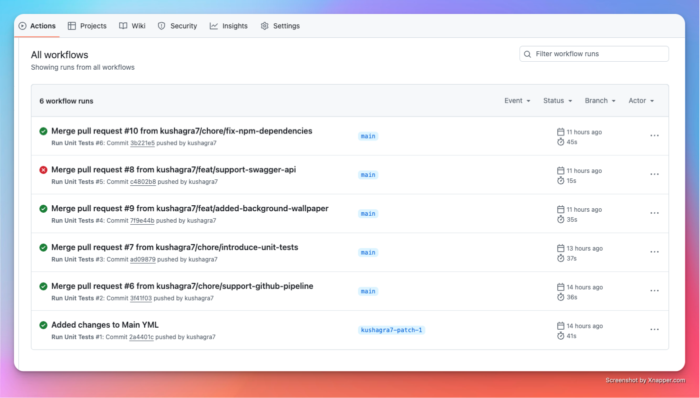
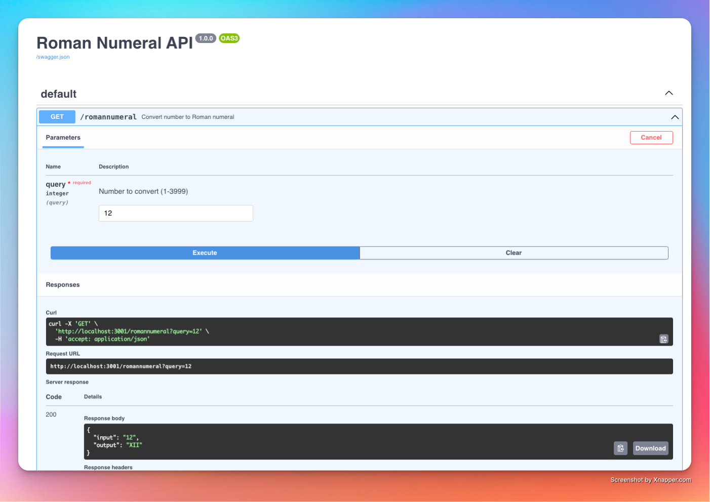

# Roman Numeral Converter App

A web application for converting numbers between 1 and 3999 into Roman numerals.
Built with Next.js, featuring dark mode support and comprehensive error validation.

Try it here: <a href="http://18.226.93.85/" target="_blank" rel="noopener noreferrer">http://18.226.93.85/</a>

## ✨ Features

- Convert any number between 1 and 3999 into Roman numerals
- Real-time error validation and feedback
- Dark mode support for enhanced accessibility
- Responsive design for devices

## 🛠️ Tech Stack

- **Frontend**: Next.js, React, Adobe React Spectrum
- **Backend**: Next.js API routes
- **Deployment**: Docker, AWS

## 🚀 Getting Started

### Prerequisites

- Node.js (v18 or later)
- Docker (optional for local)

### Local Development

1. Clone the repository:
```bash
git clone https://github.com/kushagra7/roman-numeral-challenge.git
cd roman-numeral-challenge
```

2. Install dependencies:
```bash
npm install
```

3. Start the development server:
```bash
npm run dev
```

4. Open [http://localhost:3000](http://localhost:3000) in your browser

### Docker Deployment

1. Build the image:
```bash
docker build -t roman-numeral-conversion-app .
```

2. Run the container:
```bash
docker run -p 3000:3000 roman-numeral-conversion-app
```

## 📦 Deployment 

### AWS Deployment

1. Push Docker image to AWS ECR
2. Deploy using EC2
3. Configure EC2 for public access

## 📁 Project Structure

```
roman-numeral-converter/
├── src/
│   ├── app/
│   │   ├── api/              # Backend API Directory
│   │   │   └── romannumeral/ # API endpoints
│   │   │       └── route.js  # API implementation
│   │   ├── api-docs/         
│   │   │   └── page.js       # Swagger API
│   │   ├── layout.js       
│   │   ├── page.js          # Home Page
│   │   └── tests/           # Units Test Directory
│   ├── components/
│   │   └── ui/              # UI components
│   │       ├── Card.js
│   │       ├── ErrorAlert.js
│   │       └── ResultDisplay.js
├── public/                  # Static assets
├── .babelrc               
├── Dockerfile              
├── package.json            
└── README.md              
```

## 🔄 API Reference

### Convert to Roman Numeral

```bash
GET /api/romannumeral?query={integer}
```

#### Parameters
- `query`: Integer between 1 and 3999

#### Success Response
```json
{
  "input": "1146",
  "output": "MCXLVI"
}
```

#### Error Response
```
"Invalid input. Please enter an integer between 1 and 3999."
```

## 🧪 Testing

Run the test suite:
```bash
npm test
```
### Testing Pipeline

This project uses a GitHub Actions pipeline to run unit tests automatically for the all branches. Below is an example of the pipeline interface:



### 🌐 Swagger API

This project includes a Swagger API to test the Roman numeral conversion endpoints interactively.
Test the API using Swagger UI: <a href="http://18.226.93.85/api-docs" target="_blank" rel="noopener noreferrer">http://18.226.93.85/api-docs</a>

Below is an example of the Swagger UI:




## 📦 Dependencies

The project uses the following dependencies:

- `next`: 15.1.5
- `jest`: ^29.7.0
- `@adobe/react-spectrum`: ^3.39.0
- `@spectrum-icons/workflow`: ^4.2.17
- `swagger-ui-react`: ^4.18.3
- `eslint-config-next`: 15.1.5

## 📄 License

This project is licensed under the MIT License. See the [LICENSE](LICENSE) file for details.
